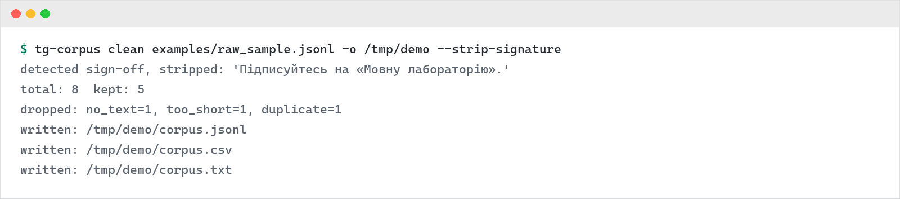

**English** | [Українська](README.uk.md)

# tg-corpus — Telegram Channel → Clean Text Corpus

A command-line tool that turns a public Telegram channel into a clean,
deduplicated text corpus ready for linguistic research, NLP pipelines or
content analysis.

## Design

Two strictly separated stages:

1. **fetch** (network) — a thin Telethon wrapper that dumps raw messages to
   JSONL, preserving metadata (id, date, views, forwards, forward flag).
2. **clean** (offline) — a pure, fully-tested pipeline: filtering, text
   cleaning, deduplication and export. Re-clean with different settings
   without re-downloading anything.

## Features

- Cleaning: emoji and pictographs, URLs, @mentions, zero-width characters,
  whitespace normalization (hashtags kept by default — often meaningful)
- Auto-detected sign-off stripping (`--strip-signature`): many channels end
  every post with a repeated line (e.g. "Subscribe" / an author credit) —
  that's boilerplate, not content, and it skews word frequencies downstream.
  Detected automatically per-channel from the data itself, nothing to
  configure by hand; channels without a repeated sign-off are left untouched
- Filtering: empty/service messages, forwards (optional), minimum word count
- Deduplication: case- and punctuation-insensitive, keeps the first
  (chronologically earliest) occurrence
- Chronological ordering restored from Telegram's newest-first API order
- Export to JSONL (full metadata), CSV (Excel-friendly) and plain text —
  one message per line, ready to pipe into downstream tools such as
  [ua-freq-dict](https://github.com/ZavarOvek/ua-freq-dict)
- Transparent drop statistics: `total: 8  kept: 5  dropped: no_text=1, too_short=1, duplicate=1`

## Install

```bash
pip install .
```

## Usage

**1. Get API credentials** at https://my.telegram.org, then save them to a
`.env` file in the project directory (already git-ignored — never commit it):

```
TG_API_ID=12345
TG_API_HASH=abcdef...
```

```bash
tg-corpus fetch @some_channel -o raw.jsonl --limit 5000
```

`.env` is loaded automatically. If you'd rather use real environment
variables instead (e.g. in CI), that works too — `.env` is just a
convenience, not a requirement.

On first run Telethon asks for your phone number and login code, then stores
a local `.session` file (also git-ignored — never commit it either).

**2. Build the corpus (offline, repeatable):**

```bash
tg-corpus clean raw.jsonl -o corpus/ --min-words 3 --drop-forwards --strip-signature
```

```
detected sign-off, stripped: 'Subscribe for more updates.'
total: 5000  kept: 4102
dropped: no_text=412, forward=305, too_short=98, duplicate=83
written: corpus/corpus.jsonl
written: corpus/corpus.csv
written: corpus/corpus.txt
```

Try it without credentials on the bundled sample:

```bash
tg-corpus clean examples/raw_sample.jsonl -o /tmp/demo --strip-signature
```



## As a library

```python
from tgcorpus import run_pipeline
from tgcorpus.io import read_jsonl

result = run_pipeline(read_jsonl("raw.jsonl"), min_words=3, drop_forwards=True)
print(result.stats)          # Counter with drop reasons
texts = [r["text"] for r in result.records]
```

## Limitations & roadmap

Deduplication is exact (after normalization); near-duplicate detection
(edit-distance / shingles) is planned. Sign-off detection matches an exact
trailing line, so a channel that varies its sign-off wording between posts
won't be caught — only literal, word-for-word repeats. Only text is
collected — media captions are included, media files are not downloaded. Respect Telegram's
Terms of Service and collect only from public channels you are allowed to
process.

## Testing

The entire cleaning pipeline is covered by offline tests on synthetic data —
no network or credentials needed:

```bash
pip install -e .[dev]
pytest
```

## License

MIT
